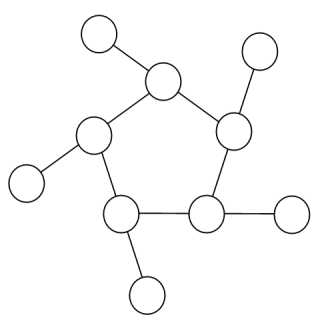

# Project Euler	Problem 068

<p align="right"><i>Tiny Snow</i></p>


## Problem

### Magic 5-gon ring

Consider the following "magic" 3-gon ring, filled with the numbers 1 to 6, and each line adding to nine.


Working **clockwise**, and starting from the group of three with the numerically lowest external node (4,3,2 in this example), each solution can be described uniquely. For example, the above solution can be described by the set: 4,3,2; 6,2,1; 5,1,3.

It is possible to complete the ring with four different totals: 9, 10, 11, and 12. There are eight solutions in total.

| **Total** | **Solution Set**    |
| --------- | ------------------- |
| 9         | 4,2,3; 5,3,1; 6,1,2 |
| 9         | 4,3,2; 6,2,1; 5,1,3 |
| 10        | 2,3,5; 4,5,1; 6,1,3 |
| 10        | 2,5,3; 6,3,1; 4,1,5 |
| 11        | 1,4,6; 3,6,2; 5,2,4 |
| 11        | 1,6,4; 5,4,2; 3,2,6 |
| 12        | 1,5,6; 2,6,4; 3,4,5 |
| 12        | 1,6,5; 3,5,4; 2,4,6 |

By concatenating each group it is possible to form 9-digit strings; the maximum string for a 3-gon ring is $432621513$.

Using the numbers 1 to 10, and depending on arrangements, it is possible to form 16- and 17-digit strings. What is the maximum **16-digit** string for a "magic" 5-gon ring?




## Solution

本题难在编程方面而非数学方面，下面按照以下步骤来解题：

- 假设问题为 *$n$ -gon ring*，考虑`digit`只会位于 $[2n+3,6n-3]$ 的区间，因此我们可以事先确定`digit`，对于确定的`digit`找到所有符合和为`digit`的三元组。
- 接下来，我们需要返回所有 $n$ 个三元组的组合，使得每个三元组和为`digit`，所有三元组中会出现所有数字，并且有5个数字只出现1次（外环数字），有5个数字出现2次（内环数字）。并且容易忽视的一点是——每个三元组将会拥有两个内环数字、一个外环数字。处理完这些判断后，返回所有的 $n$ 个三元组组合。
- 之后，注意题目要求最后`string`是16位的，也就是说10必须是外环数字，进行最后一次判断，我们就得到了所有的无序的 $n$ 个三元组组合。
- 之后我们需要确定所有三元组的位置。首先我们要从最小的外环数字开始，依次得到与外环数字相连的内环数字`second`、与该内环数字相连的下一个内环数字`next_second`，显然`next_second`会唯一出现在下一个三元组中，我们通过迭代确定所有的三元组。注意初始状态下，会有两种情况（初始三元组余下的两个内环数字可交换位置）。执行这些迭代时可以依次相加得到最后的`string`，取最大值即可。


根据以上思路，实现如下：

```python
#================================================================================Solution
import itertools

def find_magic_group(n, digit):                 # 返回和为digit的三元组
    group_list = []
    for group in itertools.combinations(range(1, 2 * n + 1), 3):
        if sum(group) == digit:
            group_list.append(group)
    return group_list

def find_comb(n, group_list):                   # 返回符合的三元组组合及内环数字
    if len(group_list) < n:
        return []

    ans_comb = []
    for comb in itertools.combinations(group_list, n):
        ans = []
        for group in comb:
            ans += group
        
        if len(set(ans)) == 2 * n:          # 保证10个数均出现
            seconds = 0                     # 判断出现两次的数的个数，即内环上的数
            second_list = []
            for i in range(1, 2 * n + 1):
                if ans.count(i) == 2:
                    seconds += 1
                    second_list.append(i)
            if seconds == n:                # 保证内环有五个数
                group_flag = True
                for group in comb:
                    group_seconds = 0       # 判断每个三元组中的内环数个数
                    for i in group:
                        if i in second_list:
                            group_seconds += 1
                    if group_seconds != 2:  # 保证每个三元组中的内环数个数为2
                        group_flag = False
                        break
                if group_flag == True:
                    ans_comb.append([comb, second_list])
    return ans_comb


n = 5
ans_list = []
for digit in range(2 * n + 3, 6 * n - 2):
    group_list = find_magic_group(n, digit)
    ans_comb = find_comb(n, group_list)
    if ans_comb != []:
        for comb in ans_comb:
            if 10 not in comb[1]:           # 保证数字总位数为16
                ans_list.append(comb)       # 获得所有可能的16-digit组合

def get_next_group(string, second, next_group_list, first_dict):    # 迭代函数，传入余下三元组集合和上一个末尾内环数，获得下一个相邻的三元组
    if len(next_group_list) == 0:
        return string
    for group in next_group_list:
        if second in group:
            temp_group = list(group)
            temp_group.remove(first_dict[group])
            temp_group.remove(second)
            next_second = temp_group[0]
            string += str(first_dict[group]) + str(second) + str(next_second)
            next_group_list.remove(group)
            return get_next_group(string, next_second, next_group_list, first_dict)


max_string = '0'                            # 获得最终的结果
for comb in ans_list:
    group_comb = comb[0]
    second_list = comb[1]
    first_dict = {}.fromkeys(group_comb)    # 将三元组与其中的外环数映射起来
    for group in group_comb:
        for i in group:
            if i not in second_list:
                first_dict[group] = i
    min_first = min(first_dict.values())    # 从外环最小数开始
    for group in group_comb:
        if min_first in group:
            del_group = group               # 需要去掉的第一个组
    next_group_list = list(group_comb)
    next_group_list.remove(del_group)
    del_group = list(del_group)
    del_group.remove(min_first)             # 遍历第一个内环数的两种可能
    string1 = get_next_group(str(min_first) + str(del_group[1]) + str(del_group[0]), del_group[0], next_group_list, first_dict)
    strint2 = get_next_group(str(min_first) + str(del_group[1]) + str(del_group[0]), del_group[1], next_group_list, first_dict)
    max_string = str(max(int(max_string), int(string1), int(strint2)))
print(max_string)
#================================================================================Answer
The Answer is 6531031914842725
```

